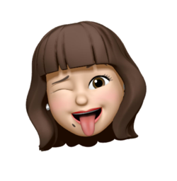
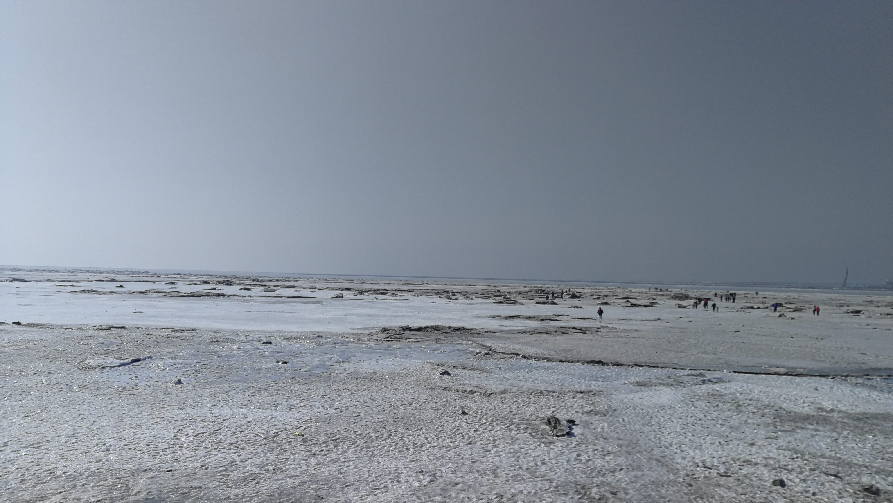
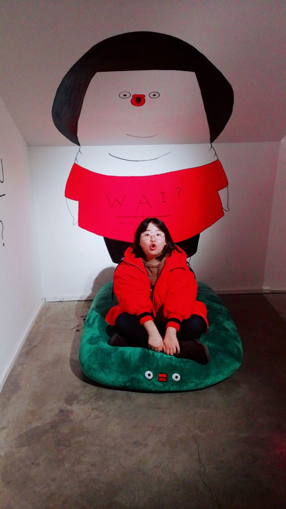
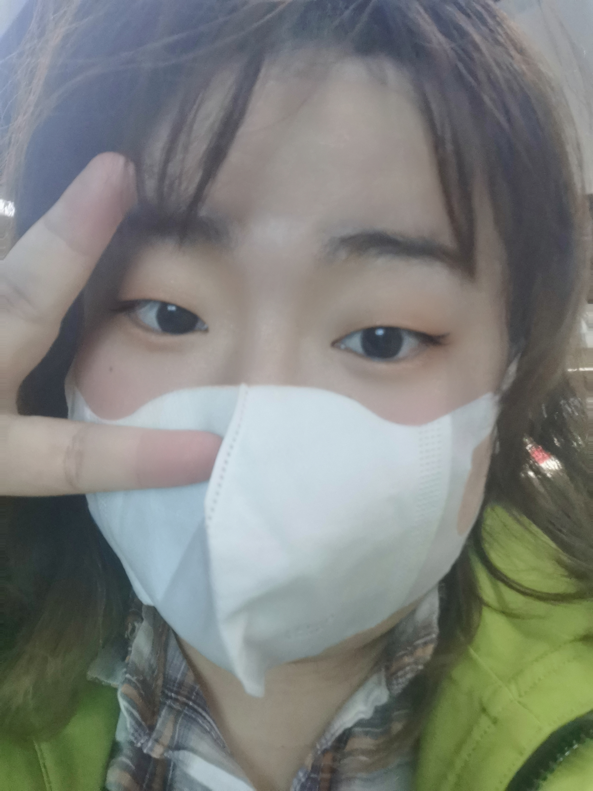
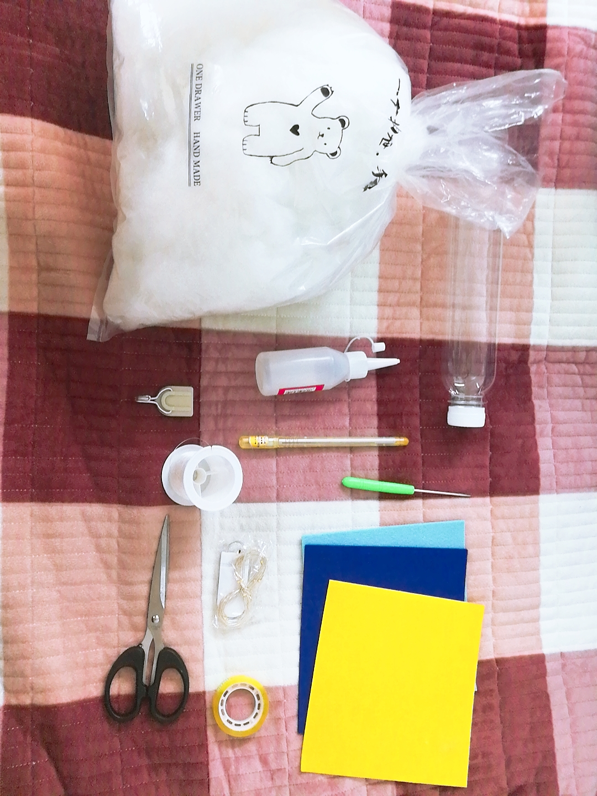
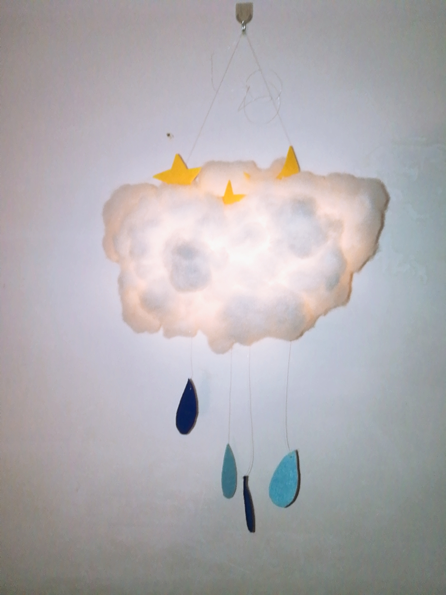
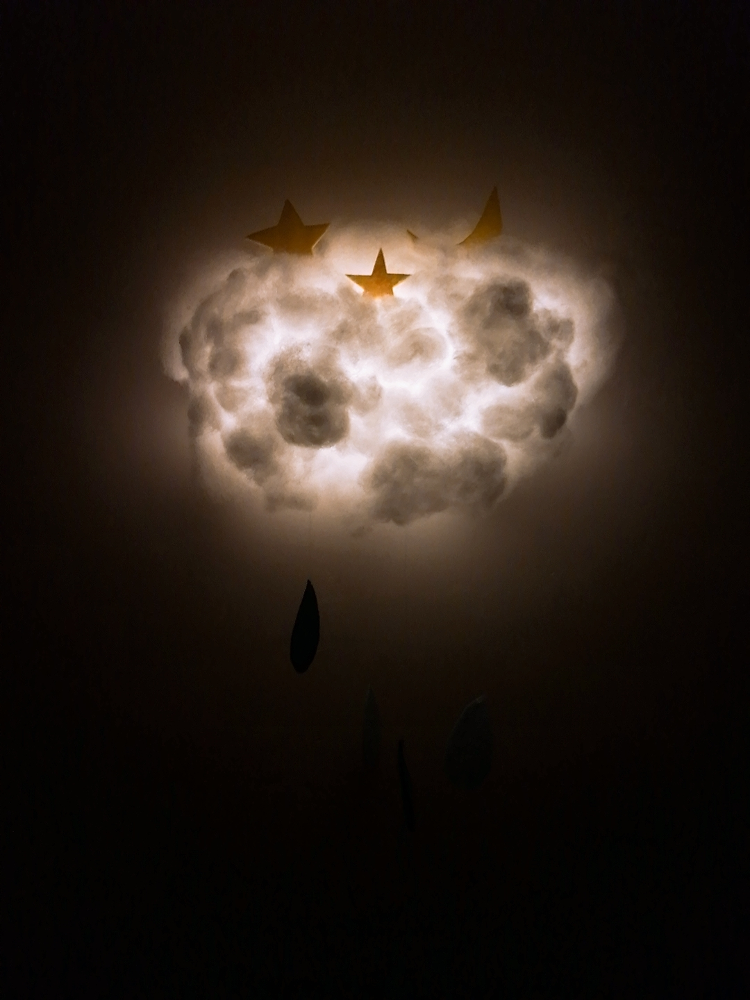
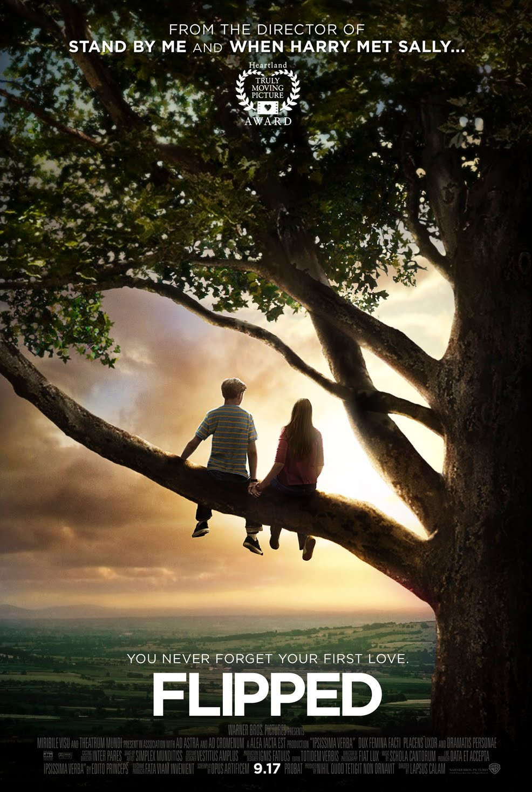
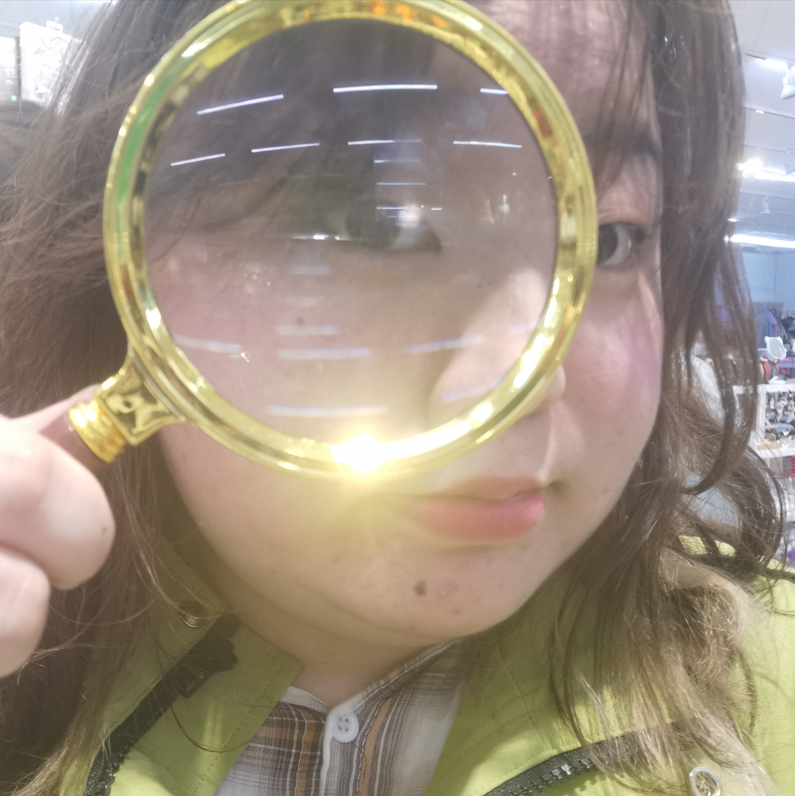

# Welcome to my Org 👋

Hi~This is Bai Hui. 

My name writen in Chinese is 柏慧.

柏 is my last name, which is special and help me make friends rapidly. 

Because nobody can forget my name after the first time they heard it.

I'm a girl from the northeast of China. But my hometown is near by the sea.

This is the forzen sea in winter. Another is the beach in summer.

 

This is me in 2019.

And this is me in 2021. We have to live with the masks, that reduces my makeup frequency.

My favirote singer is Jay Chou. (Wating for his new album ) 

I like singing, but I'm really not good at it.

I also like making handcrafts. This is one of my works.

  

My favorite movie is Flipped.

Crayon Shin-chan is my "best friend", that always accompany me when I am eating.

This is the YeYuans' family picture painted by me.

I also love The Famous Detective Conan. 

When I was a child, I have a dream. I dreamed to be a ownner of a book shop, so that I chould read the books and magazines immediately as they were published.

